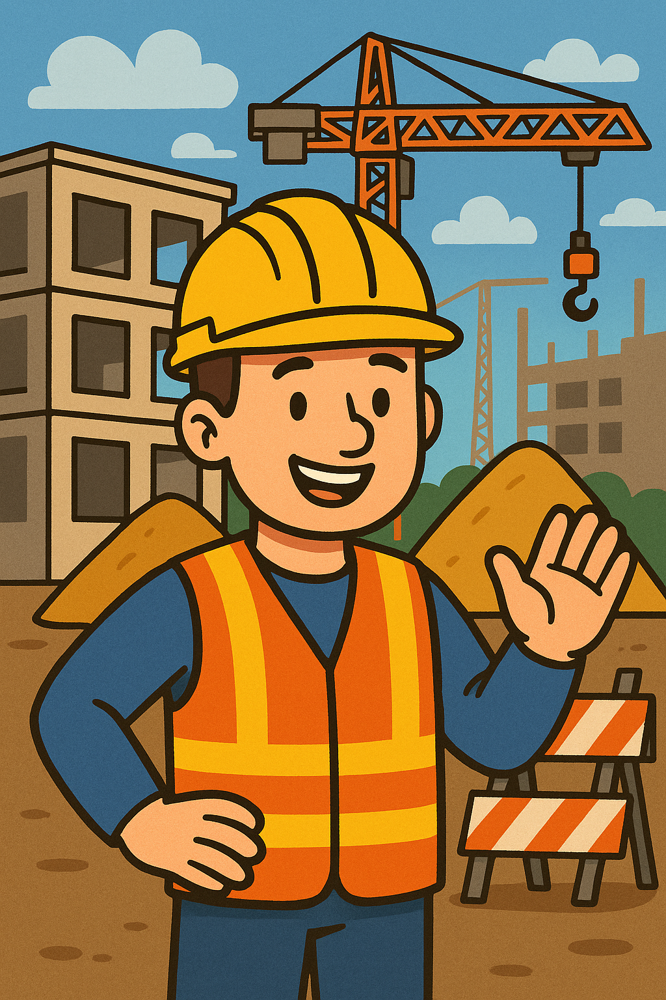

# Real-Time PPE Detection System using YOLOv8


> Construction remains one of the most hazardous industries worldwide. In the U.S., the construction sector accounts for about 20% of all worker fatalities despite comprising only around 6% of the workforce. The most lethal risks—dubbed OSHA’s "Fatal Four"—include falls, struck-by incidents, electrocutions, and caught-in/between accidents, collectively responsible for roughly 60–65% of construction deaths.

>This project addresses a critical and measurable failure point in construction safety. It targets the root cause behind many preventable fatalities—non-compliance with PPE usage—and offers a proactive, real-time safety solution.


## Introduction

This project implements a real-time Personal Protective Equipment (PPE) detection system using YOLOv8. The system can monitor construction site safety by detecting whether workers are wearing proper safety equipment like helmets and safety vests.

## Features

- Real-time PPE detection using webcam feed
- Detection of multiple PPE classes including:
  - Hardhat/Helmet
  - Safety Vest
  - Person
  - Safety Equipment violations (NO-Hardhat, NO-Vest)
- Safety compliance status monitoring
- FPS counter for performance tracking
- Screenshot capture functionality
- Color-coded detection boxes and status indicators

## Project Structure

```
├── data/
│   ├── data.yaml         # Dataset configuration
│   ├── test/             # Test images
│   ├── train/            # Training images
│   └── valid/            # Validation images
├── models/
│   ├── best.pt           # Best model 
│   └── yolov8.pt         # Pre-trained YOLOv8 model
├── results/
├── scripts/
│   ├── evaluate.py       # Evaluation script
│   └── train.py          # Train script
├── models/
│   ├── best.pt           # Best model 
│   └── yolov8.pt         # Pre-trained YOLOv8 model
└── ppe_webcam.py        # Real-time detection script
```

## Setup and Installation

1. Clone this repository
2. Install dependencies:
```bash
pip install ultralytics
pip install opencv-python
```

## Usage

### Training the Model
```bash
python scripts/train.py
```
The training script will:
- Load a pre-trained YOLOv8s model
- Train for 50 epochs on the custom PPE dataset
- Save the best model weights

### Running Real-time Detection
```bash
python ppe_webcam.py
```

Controls:
- Press 'q' to quit
- Press 's' to save a screenshot

## Implementation Details

### PPEDetector Class
The main detection system is implemented in the `PPEDetector` class with the following key features:

- Real-time safety compliance checking
- Color-coded status indicators:
  - Green: Fully compliant
  - Orange: Partially compliant
  - Red: Non-compliant
  - Gray: No person detected
- Bounding box visualization with confidence scores
- FPS monitoring

### Model Training
- Base model: YOLOv8s
- Training parameters:
  - Epochs: 50
  - Image size: 640x640
  - Batch size: 16

## Evaluation
The model is evaluated using the `evaluate.py` script, which computes:


>The YOLOv8 model trained on the custom Roboflow dataset for PPE detection demonstrates strong and consistent learning performance.

> Training and validation losses for bounding box localization, classification, and distribution focal loss all show steady declines, indicating improved object recognition and positioning over time.

>Precision reaches \~90% and recall \~83%, meaning the model effectively reduces both false positives and false negatives. 

> The high mAP50 (\~0.9) reflects excellent detection accuracy at a standard IoU threshold, while the mAP50-95 (\~0.5) confirms solid performance even under stricter evaluation. 

> These results highlight the model’s reliability in accurately identifying workers’ safety equipment, making it a valuable tool for preventing accidents and enhancing on-site compliance monitoring.

## Results

The system provides:
- Real-time detection and classification
- Visual feedback through color-coded boxes
- Safety compliance status
- Performance metrics (FPS)

## Future Improvements

1. Multi-camera support
2. Logging and reporting features
3. Integration with alarm systems
4. Worker tracking and identification
5. Cloud storage for violations
6. Mobile app integration


## Acknowledgments

- [Ultralytics](https://docs.ultralytics.com) for YOLOv8
- [Roboflow](https://universe.roboflow.com) for the dataset
